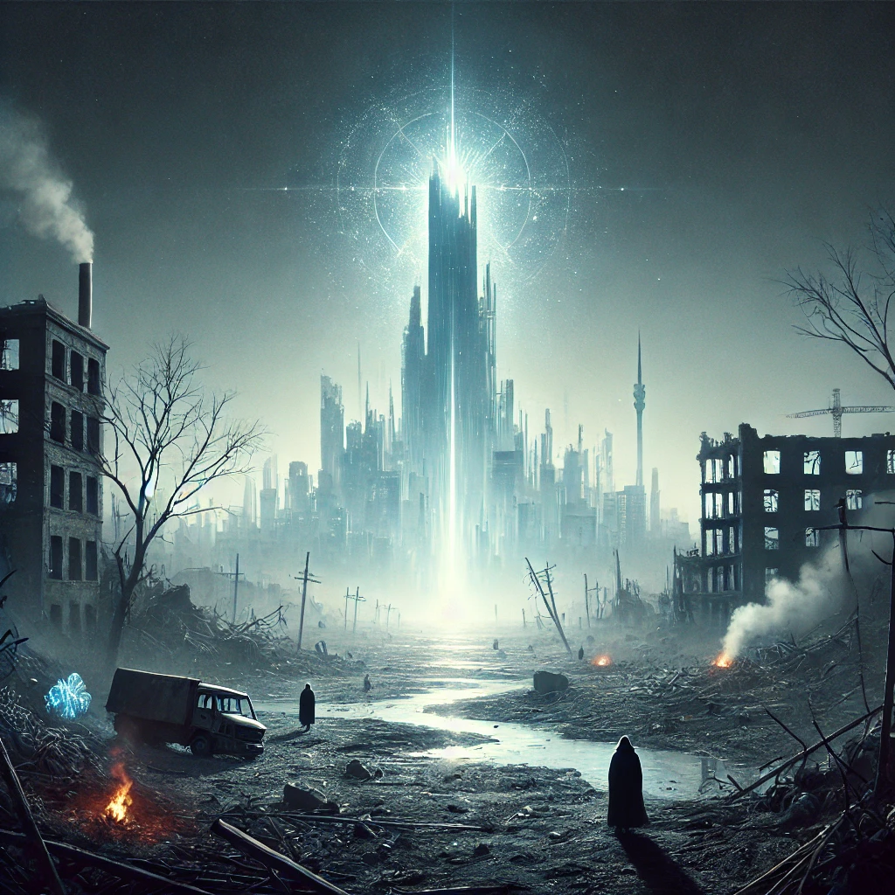

# Welcome to Shattered Requiem

## Survivor,

The promise of Utopia, a new Atlantis, was empty. Our demagogues crafted visions of prosperity, free energy, eternal life. But those gifts were for highborns. Useless eaters, they call us. Genetic hazards to prune like crooked shoots. We were lied to, our minds and bodies poisoned. A single voice couldn't break their hold. But the blood of martyrs stoked a flame.

Project Aion was to go online--their ascent to godhood. Iter hacked the Citadel's CCTVs and we saw those bastards congratulating each other, indulging sick pleasures. The pinnacle of humanity, *heh*. Plans to vacate and cleanse the planet. We fought back: scorched earth suicide.

Stuxnet-terminus is what I named it. Armageddon rolled into 16 kilobytes of binary. My *magnum opus*, a final fuck you to the suits. There was one target: an actuator deep within the Global Village Fusion Center. The complex was impenetrable, its entire network air-gapped, with Faraday shields that could withstand a tactical nuke. Droids kept the equipment in good repair. Perfectly compliant. GVFC mercs made sure no unregistered soft bodies came within two clicks of the perimeter walls.

There was one crack in the defense, just big enough to slip through: A lone engineer, Dimitar Borisov. He was a Bulgarian prick, the only human allowed into the facility interior. Once every full moon, he'd descend into the fortress's bowels to upgrade firmware.

They could have had a drone load the patches. Sociopaths get off to that kind of theater, though. Which was fine enough. We cooked and propagated a payload: Everything that touched the net got a copy. In nine months, Mr. Borisov's implant pinged us.

Temperature, coordinates, kernel process, MAC on the FPGA--over one-hundred parameters accounted for. Nicking that info wasn't easy. Disguising the exploit, that was the real bitch. What happened next, well, maybe there's something to that starlord crap they're peddling. Dimensional rifts? A disease? Mutation? Whatever it is, the explosion bought us a new life. Unholy ambition put us into a desperate war against undead hordes. Against ourselves.

I welcome you to a Shattered Requiem. Enemies are born in chaos and allies, in blood.

I invite you to find the Citadel, our stronghold and a safe haven. Or you can take it for yourself, if you can. Carve a path, hunt treasure and defy this abysmal fate.

But make sure to prepare yourself. Night is coming.

---

Doulos Khristos

*GVFC Citadel*
